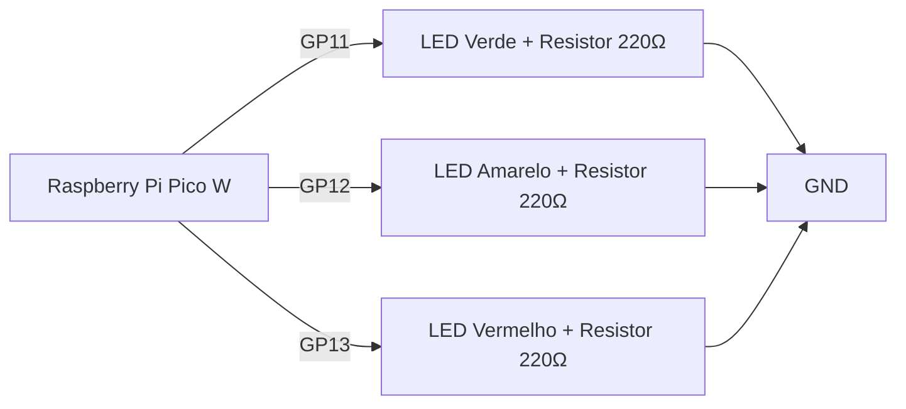
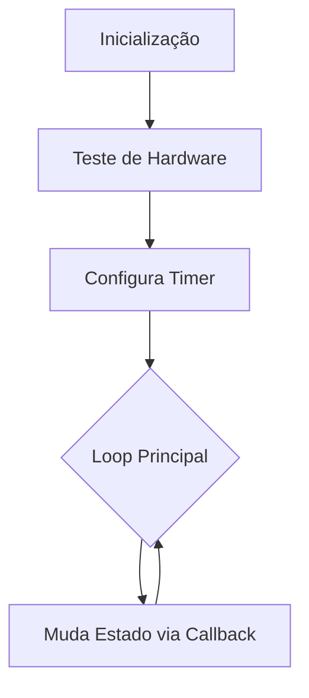
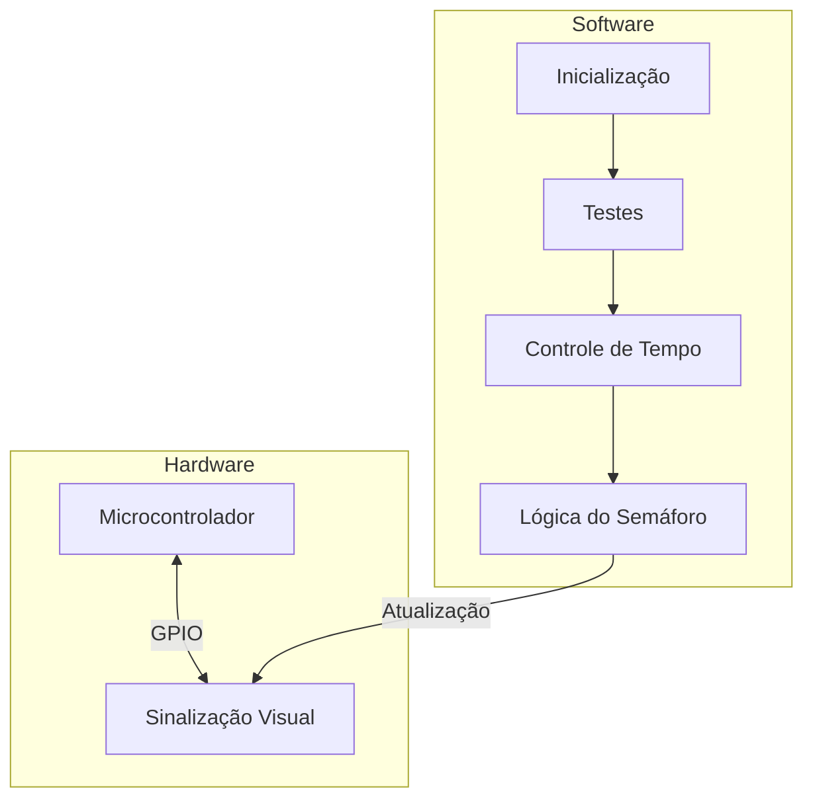

# Sistema de Semáforo Inteligente

Implementação de um sistema de semáforo utilizando Raspberry Pi Pico W

## Recursos Implementados

- Ciclo automático de estados (Vermelho → Amarelo → Verde)
- Testes de hardware inicial
- Verificação contínua de transição de estados
- Logs detalhados de operação


## Diagramas do Sistema

### 1. Diagrama de Conexões do Hardware



### 2. Fluxo de Operação do Sistema



## 2. Fluxo de Operação do Sistema




## Instalação

### Hardware Necessário

- Raspberry Pi Pico
- 3 LEDs (Vermelho, Amarelo, Verde)
- Resistores 220Ω
- Protoboard
- Jumpers

### Conexões

| LED      | Pino GPIO |
| -------- | --------- |
| Vermelho | 13        |
| Amarelo  | 12        |
| Verde    | 11        |

### Software

1. Instale o SDK do Raspberry Pi Pico
2. Clone este repositório
3. Compile o projeto:

```bash
mkdir build && cd build
cmake ..
make
```

## Uso

1. Carregue o firmware `main.uf2` na Pico
2. Conecte ao terminal serial (115200 bauds)
3. O sistema iniciará automaticamente

## Testes Implementados

1. **Teste de Hardware Inicial**

   - Pisca cada LED sequencialmente
   - Verifica operação básica dos LEDs
2. **Teste de Transição de Estados**

   - Verifica cada mudança de estado do semáforo
   - Relata falhas imediatamente via console serial
3. **Teste de Temporização**

   - Garante mudanças a cada 3 segundos
   - Verifica consistência do ciclo

# 🔄 **Lógica de Funcionamento**

### 1. Inicialização (`init_gpio()`)
- Configura os pinos dos LEDs como saídas.
- Define o estado inicial:
  - Vermelho: **LIGADO**
  - Amarelo/Azul e Verde: **DESLIGADOS**.

### 2. Ciclo do Semáforo (`change_trafficLight()`)
Controlado por um timer repetitivo que alterna os estados a cada 3 segundos:
1. **Estado 1 (Vermelho - "Pare")**  
   - `LED_RED` ligado, outros desligados.
2. **Estado 2 (Amarelo/Azul - "Atenção")**  
   - `LED_BLUE` ligado, outros desligados.
3. **Estado 3 (Verde - "Siga")**  
   - `LED_GREEN` ligado, outros desligados.

### 3. Comunicação Serial
- Mensagens de status são enviadas via USB-Serial em cada transição:

"Pare: Sinal vermelho ativo"
"Atenção: Sinal amarelo ativo..."
"Siga: Sinal verde ativo"

## Monitoramento

Acompanhe o funcionamento via console serial:

```bash
screen /dev/ttyACM0 115200
```

## Estrutura do Código

- `main.c`: Implementação principal
- `CMakeLists.txt`: Configuração de compilação
- `README.md`: Documentação do projetoflowchart TD

  A[Inicialização] --> B[Teste de Hardware]
  B --> C[Configura Timer]
  C --> D{Loop Principal}
  D --> E[Muda Estado via Callback]
  E --> D

---
## Explicação do código

### ⏲ **Controle de Temporização**
- Utiliza um `repeating_timer` do hardware para garantir precisão:
- Intervalo fixo de `3000 ms` (3 segundos).
- A função `change_trafficLight` é chamada automaticamente a cada intervalo.

---

### 🔄 **Loop Principal (`main()`)**
1. Inicializa comunicação serial e GPIO.
2. Configura o timer para disparar `change_trafficLight`.
3. Mantém um loop infinito com mensagens periódicas no serial para monitoramento.

---

### ⚙️ **Notas Importantes**
- **LED Amarelo/Azul**: O pino `LED_BLUE` pode variar conforme o hardware (azul na BitDogLab, amarelo no Wokwi).
- **Eficiência**: O uso de timer hardware evita bloqueios no loop principal.
- **Personalização**: Para ajustar o tempo do ciclo, modifique `TIMER_CHANGE_SINAL`.

---

## Explicação em Video

No link abaixo, apresento sobre o funcionamento do projeto no simulador Wokwi e na placa BitDogLab 
 https://youtu.be/Pngk_arJvDM