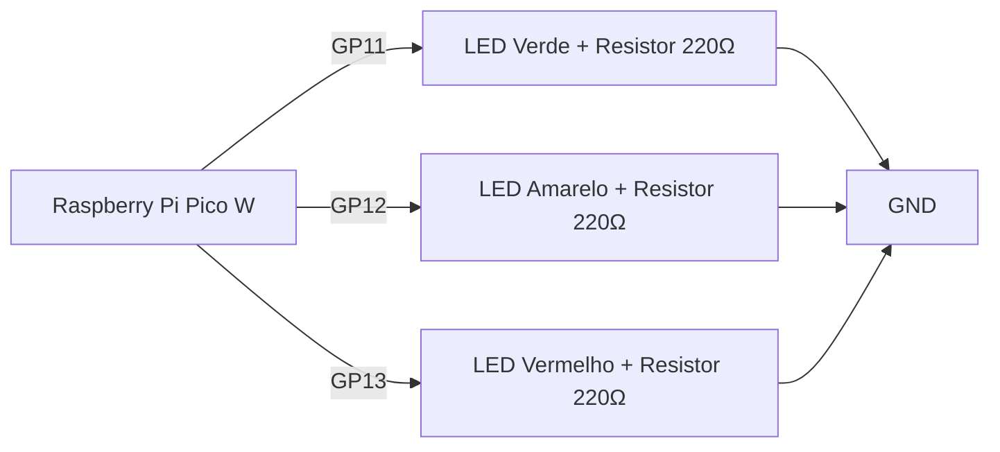
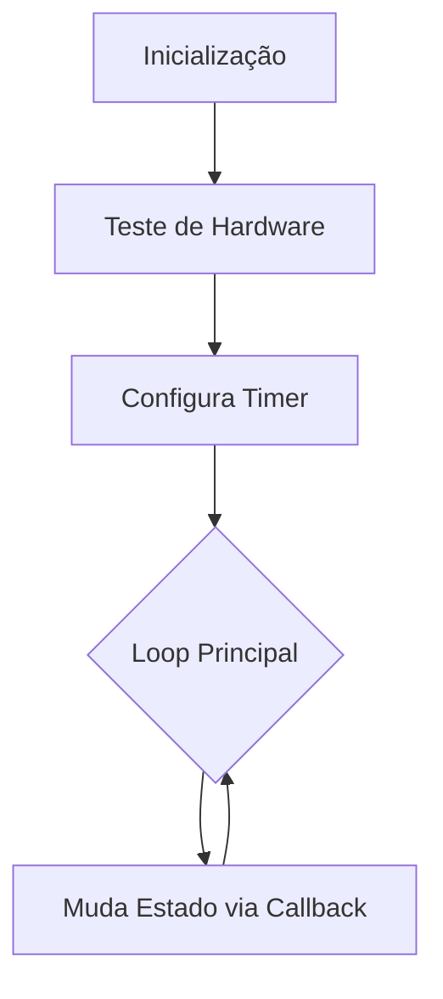
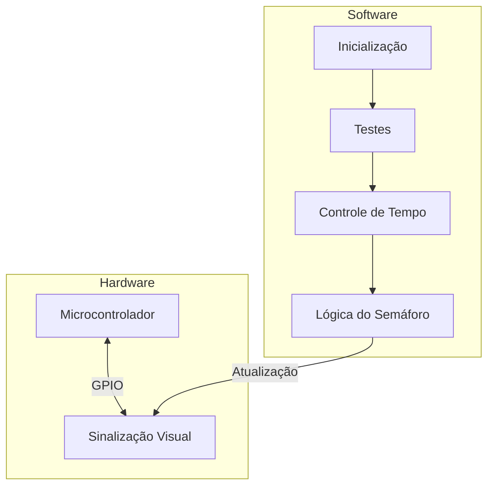

# Sistema de Semáforo Inteligente

Implementação de um sistema de semáforo utilizando Raspberry Pi Pico

## Recursos Implementados

- Ciclo automático de estados (Vermelho → Amarelo → Verde)
- Testes de hardware inicial
- Verificação contínua de transição de estados
- Logs detalhados de operação

## Diagramas do Sistema

### 1. Diagrama de Conexões do Hardware



### 2. Fluxo de Operação do Sistema



## 2. Fluxo de Operação do Sistema




## Instalação

### Hardware Necessário

- Raspberry Pi Pico
- 3 LEDs (Vermelho, Amarelo, Verde)
- Resistores 220Ω
- Protoboard
- Jumpers

### Conexões

| LED      | Pino GPIO |
| -------- | --------- |
| Vermelho | 13        |
| Amarelo  | 12        |
| Verde    | 11        |

### Software

1. Instale o SDK do Raspberry Pi Pico
2. Clone este repositório
3. Compile o projeto:

```bash
mkdir build && cd build
cmake ..
make
```

## Uso

1. Carregue o firmware `main.uf2` na Pico
2. Conecte ao terminal serial (115200 bauds)
3. O sistema iniciará automaticamente

## Testes Implementados

1. **Teste de Hardware Inicial**

   - Pisca cada LED sequencialmente
   - Verifica operação básica dos LEDs
2. **Teste de Transição de Estados**

   - Verifica cada mudança de estado do semáforo
   - Relata falhas imediatamente via console serial
3. **Teste de Temporização**

   - Garante mudanças a cada 3 segundos
   - Verifica consistência do ciclo

## Monitoramento

Acompanhe o funcionamento via console serial:

```bash
screen /dev/ttyACM0 115200
```

## Estrutura do Código

- `main.c`: Implementação principal
- `CMakeLists.txt`: Configuração de compilação
- `README.md`: Documentação do projetoflowchart TD

  A[Inicialização] --> B[Teste de Hardware]
  B --> C[Configura Timer]
  C --> D{Loop Principal}
  D --> E[Muda Estado via Callback]
  E --> D
