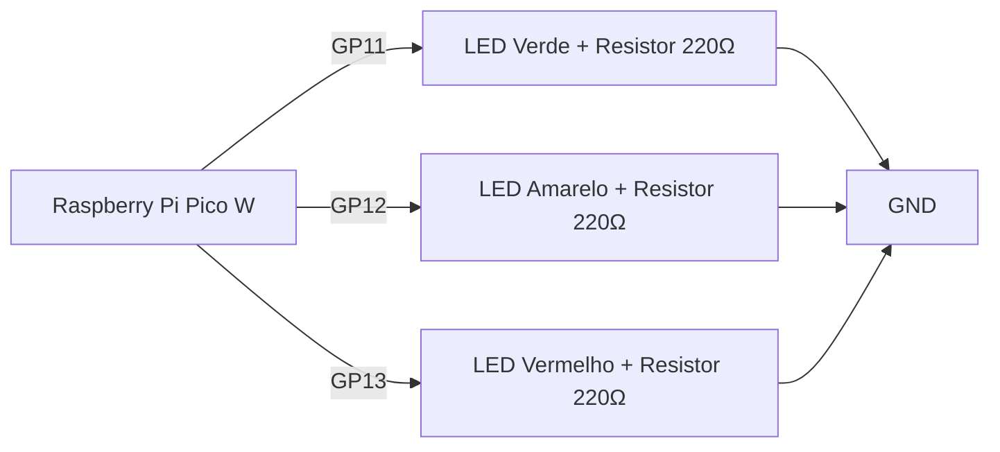
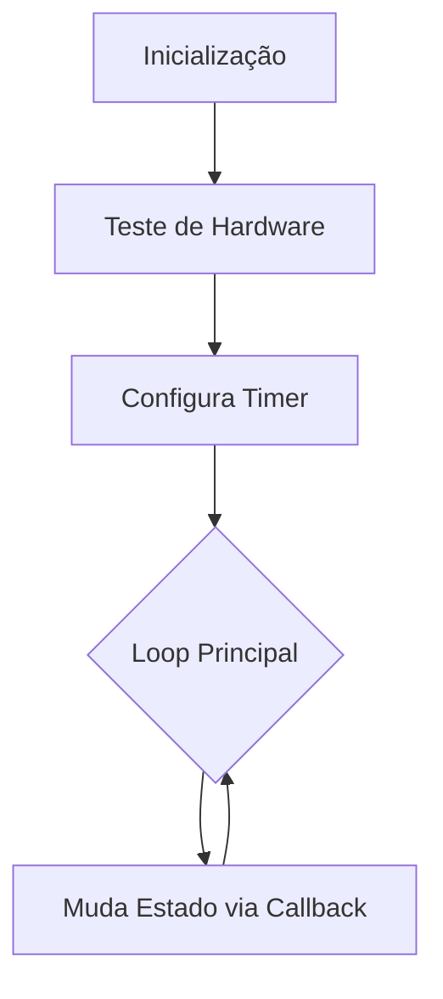
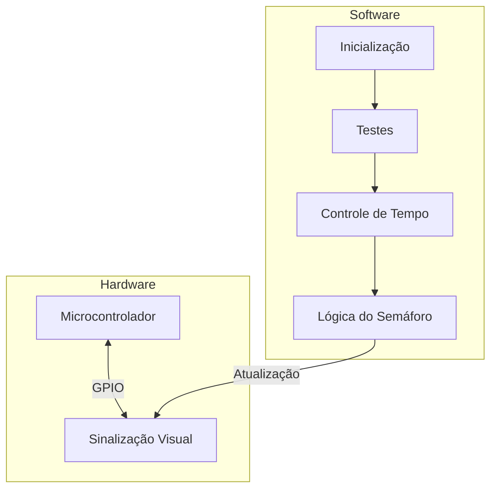

# Sistema de Semáforo Inteligente

**Autor: Luis Felipe Pereira de Carvalho**

**Técnico em Analises e Desenvolvimento de Sistemas - SENAI**

**Graduando em Bacharelado de Engenharia de Computação - UEFS**

## 1. Objetivos

Este projeto visa implementar um sistema de semáforo utilizando o Raspberry Pi Pico W, com temporização controlada por um timer periódico. Abaixo estão os objetivos principais:

### **1. Implementação da Lógica do Semáforo**

* Iniciar o ciclo do semáforo com o **LED vermelho** aceso.
* Após 3 segundos, alterar para o **LED amarelo** (vermelho desliga, amarelo acende).
* Após mais 3 segundos, alterar para o **LED verde** (amarelo desliga, verde acende).
* Repetir o ciclo indefinidamente com intervalos de 3 segundos entre cada transição.

### **2. Configuração do Temporizador Periódico**

* Utilizar a função `add_repeating_timer_ms()` do Pico SDK para criar um timer que dispare a cada  **3.000 ms** .
* Garantir que a mudança de estados dos LEDs seja controlada pela função de *callback* do temporizador.

### **3. Função de Callback para Controle dos LEDs**

* Implementar a lógica de transição dos LEDs na função `repeating_timer_callback()`, seguindo o fluxo:
  `Vermelho → Amarelo → Verde → Vermelho...`
* Assegurar que apenas um LED esteja aceso em cada fase do ciclo.

### **4. Comunicação Serial na Rotina Principal**

No loop `while` principal, exibir mensagens periódicas pela porta serial a cada **1 segundo** (ex: status atual do semáforo, contagem de ciclos ou timestamp).

### **5. Validação do Funcionamento**

Testar o sistema para garantir que as transições ocorram exatamente a cada 3 segundos.

Verificar se a comunicação serial exibe informações consistentes e sem corrupção.

### **6. Opcional: Mitigação de Bouncing (Debounce)**

* Implementar uma rotina de *software debounce* caso um botão seja adicionado para interromper/reiniciar o ciclo (não exigido, mas valorizado).

## 2. Descrição

Este projeto implementa um **semáforo automatizado** utilizando o Raspberry Pi Pico W, com temporização controlada por um timer periódico. O sistema alterna entre três estados (vermelho, amarelo e verde) a cada 3 segundos, seguindo o padrão de um semáforo convencional.

### **Funcionalidades Principais**

1. **Ciclo Automático de Estados:**
   * **Vermelho (Pare):** Inicia o ciclo com o LED vermelho aceso.
   * **Amarelo (Atenção):** Após 3 segundos, o LED amarelo (simulado pelo LED azul no BitDogLab) é ativado.
   * **Verde (Siga):** Após mais 3 segundos, o LED verde é acionado, reiniciando o ciclo.
2. **Temporização Precisão:**
   * Utiliza a função `add_repeating_timer_ms()` do Pico SDK para garantir intervalos exatos de **3.000 ms** entre as transições.
3. **Feedback em Tempo Real:**
   * A cada mudança de estado, uma mensagem é enviada pela porta serial (ex:  *"Atenção: Sinal amarelo ativo"* ).
   * O loop principal exibe *"Sistema de Semáforo"* a cada 1 segundo para monitoramento do sistema.
4. **Compatibilidade com Hardware:**
   * **BitDogLab:** Utiliza o LED RGB (GPIOs 11, 12 e 13) para simular as cores do semáforo:
     * Vermelho: GPIO 13
     * Amarelo (simulado pelo LED azul): GPIO 12
     * Verde: GPIO 11

## 3. Recursos Implementados

- Ciclo automático de estados (Vermelho → Amarelo → Verde)
- Testes de hardware inicial
- Verificação contínua de transição de estados
- Logs detalhados de operação

## 4. Diagramas do Sistema

### 1. Diagrama de Conexões do Hardware



### 2. Fluxo de Operação do Sistema



### 3. Fluxo de Operação do Sistema



## 5. Requisitos do Projeto

* Placa Raspberry Pi Pico (RP2040)
* Ambiente de desenvolvimento configurado (SDK do RP2040, compilador C/C++)
* LEDs RGB conectados aos pinos 11, 12 e 13

## 6. Como Executar o Programa

### 1. Configuração do Ambiente

* Instale o SDK do Raspberry Pi Pico seguindo a documentação oficial.
* Configure a ferramenta de build `CMake` e o compilador ARM.

### 2. Compilação do Código

* Clone o repositório ou copie o código para um diretório local.
* No terminal, navegue até o diretório do projeto e execute:
  ```sh
  mkdir build && cd build
  cmake ..
  make
  ```

### 3. Upload para a Raspberry Pi Pico W

* Conecte a Raspberry Pi Pico ao computador enquanto segura o botão `BOOTSEL`.
* Copie o arquivo `.uf2` gerado para a unidade que aparecerá no sistema.
* Conecte ao terminal serial (115200 bauds).
* A Pico será reiniciada automaticamente e executará o código.

## Testes Implementados

1. **Teste de Hardware Inicial**

   - Pisca cada LED sequencialmente
   - Verifica operação básica dos LEDs
2. **Teste de Transição de Estados**

   - Verifica cada mudança de estado do semáforo
   - Relata falhas imediatamente via console serial
3. **Teste de Temporização**

   - Garante mudanças a cada 3 segundos
   - Verifica consistência do ciclo

## **7. Lógica de Funcionamento**

### 1. Inicialização (`init_gpio()`)

- Configura os pinos dos LEDs como saídas.
- Define o estado inicial:
  - Vermelho: **LIGADO**
  - Amarelo/Azul e Verde: **DESLIGADOS**.

### 2. Ciclo do Semáforo (`change_trafficLight()`)

Controlado por um timer repetitivo que alterna os estados a cada 3 segundos:

1. **Estado 1 (Vermelho - "Pare")**
   - `LED_RED` ligado, outros desligados.
2. **Estado 2 (Amarelo/Azul - "Atenção")**
   - `LED_BLUE` ligado, outros desligados.
3. **Estado 3 (Verde - "Siga")**
   - `LED_GREEN` ligado, outros desligados.

### 3. Comunicação Serial

- Mensagens de status são enviadas via USB-Serial em cada transição:

"Pare: Sinal vermelho ativo"
"Atenção: Sinal amarelo ativo..."
"Siga: Sinal verde ativo"

#### Monitoramento

Acompanhe o funcionamento via console serial:

```bash
screen /dev/ttyACM0 115200
```

## 8. Estrutura do Código

- `main.c`: Implementação principal
- `CMakeLists.txt`: Configuração de compilação
- `README.md`: Documentação do projeto

### **Controle de Temporização**

- Utiliza um `repeating_timer` do hardware para garantir precisão:
- Intervalo fixo de `3000 ms` (3 segundos).
- A função `change_trafficLight` é chamada automaticamente a cada intervalo.

### **Loop Principal (`main()`)**

1. Inicializa comunicação serial e GPIO.
2. Configura o timer para disparar `change_trafficLight`.
3. Mantém um loop infinito com mensagens periódicas no serial para monitoramento.

### **Notas Importantes**

**LED Amarelo/Azul**: O pino `LED_BLUE` pode variar conforme o hardware (azul na BitDogLab, amarelo no Wokwi).

**Eficiência**: O uso de timer hardware evita bloqueios no loop principal.

**Personalização**: Para ajustar o tempo do ciclo, modifique `TIMER_CHANGE_SINAL`.

## 9. Referências

* [Documentação da Raspberry Pi Pico](https://www.raspberrypi.com/documentation/microcontrollers/)
* [RP2040 Datasheet](https://datasheets.raspberrypi.com/rp2040/rp2040-datasheet.pdf)

## 10. Explicação em Video

No link abaixo, apresento sobre o funcionamento do projeto no simulador Wokwi e na placa BitDogLab: 

[Video Demostrativo](https://youtu.be/Pngk_arJvDM)
